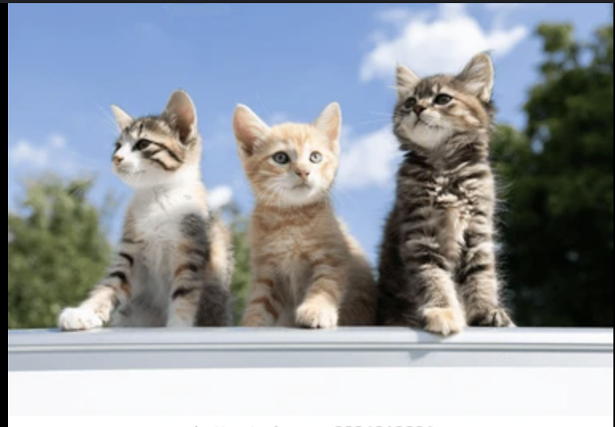

# %User

How many dogs are in the image? What breeds of dog are they?

# %Assistant

There are no dogs in this image. The image shows three kittens or young cats sitting together outdoors. They appear to be different breeds or colors - one tabby, one ginger, and one with mixed coloring.
